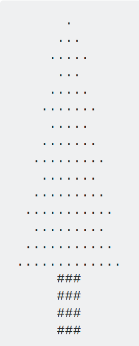

% Lecture 3: loops and functions
% Programming for VR I
% Patrick Mineault
---
pandoc-latex-fontsize:
  - classes: [listing]
    size: scriptsize
  - classes: [footnote]
    size: tiny
---

# Reminder

* We have a pop quiz this afternoon.
* It's worth 5 points.
* It's 5 questions + 2 bonus, you can get max 5 points.
* Everything in the quiz will be seen at some point in the morning.

# For loops

* Sometimes you need to do things multiple times.
* Example: factorial:

`factorial(x) -> x * (x - 1) * (x - 2)  * ... * 2 * 1`
`factorial(5) -> 5 * 4 * 3 * 2 * 1 -> 120`

# How to write a `for` loop

```{.python}
number_of_times = 5
for i in range(number_of_times):
  print(i)
```

# For iterates over stuff

```{.listing}
>>> help(range)

class range(object)
 |  range(stop) -> range object
 |  range(start, stop[, step]) -> range object
 |  
 |  Return an object that produces a sequence of integers from start (inclusive)
 |  to stop (exclusive) by step.  range(i, j) produces i, i+1, i+2, ..., j-1.
 |  start defaults to 0, and stop is omitted!  range(4) produces 0, 1, 2, 3.
 |  These are exactly the valid indices for a list of 4 elements.
 |  When step is given, it specifies the increment (or decrement).
 |  
```

# Wut?

```
>>> for i in range(1, 14, 2):
...   print(i)
...
1
3
5
7
9
11
13
```

# Ah

```
>>> for i in range(5):
...   print(i)
...
0
1
2
3
4
```

# Back to our original example

```{.python}
# print factorial(5)
num = 5
for ???:
  stuff???
print(factorial)  # I guess?!
print("halp!")
```

# How programmers get better

* Pair programming
* Driver & navigator
* The driver types
* The navigator points, observes
* Then you switch
* Instant feedback!

# Let's try it!

* Print factorial 5

# Blocks

* We know two kinds of blocks: `if` and `for`

```
blocktype condition:
␣␣instruction inside the first block
␣␣second blocktype condition:
␣␣␣␣instruction inside the second block
␣␣instruction inside the first block
instruction outside blocks
```

* Whitespace is critical! Keep stuff aligned. Change your settings in Notepad++ if you need to.
* My preference: two spaces. However, wars have been started over this.

# Mixing `if` and `for`

* Example: check if a number is prime
* An integer is prime if it can be divided by 1 and itself only
* How do you check that? Try dividing all the numbers smaller than the number we care about.

```
num = 10 -> "Not a prime"
```

```
num = 13 -> "A prime"
```

# Check if a number is prime

* You might need to break out of the loop early: `break`
* Remember `%`

# Functions

* Functions divide your code into useful blocks.
* They make things reusable.

```{.listing .python}
def printy_sum(arg1, arg2):
  """printy_sum is a function that prints two arguments and returns their sum

  Args:
    arg1: the first argument
    arg2: the second

  Returns:
    their sum
  """
  print(arg1)
  print(arg2)
  return arg1 + arg2
```

# Let's re-write our factorial function this way!

```{.python}
def factorial(num):
  ...
  return the_computed_factorial
```

# Did you catch all the edge cases?

* What happens with factorial(0)?
* What about a negative number? A float?

# Leap year

* A year is a leap year if it can be divided by 4
* Except if it can be divided by 100
* Except except if it can be divided by 400
* In other words, 1600 is a leap year, but not 1700, 1800 or 1900

```{.footnote}
https://www.hackerrank.com/challenges/write-a-function/problem
```

# How programmers become better

* `assert`: check that code does what it's supposed to.

# Stretch goal

 * Make me a holiday tree
 * `tree(5)` prints:



# Hint

* Create a function that pads and centers a string
* `pad_and_center("hello", 11) -> "   hello   "`
