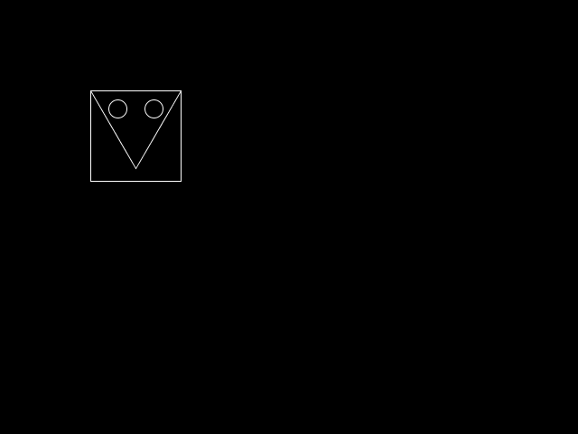
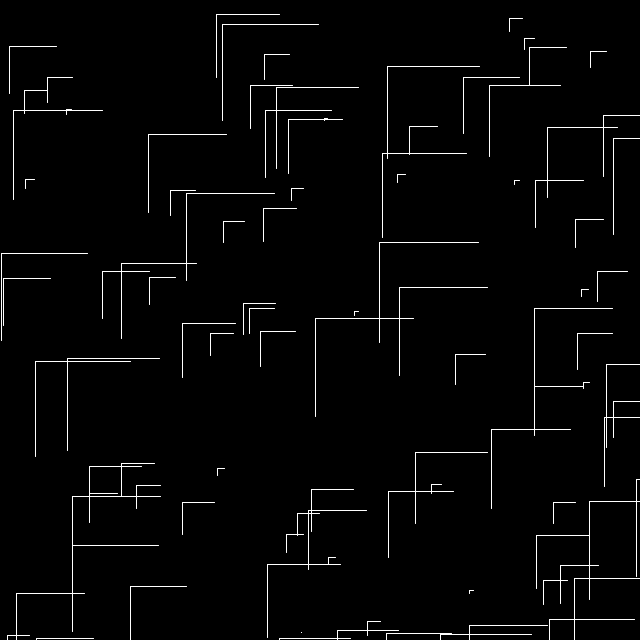

% Lecture 4: processing.py
% Programming for VR I
% Patrick Mineault
---
pandoc-latex-fontsize:
  - classes: [listing]
    size: scriptsize
  - classes: [footnote]
    size: tiny
---

# `processing.py`

* We're gonna make pretty stuff today!
* From the website: Processing is a flexible software sketchbook and a language
  for learning how to code within the context of the visual arts.
* By default, Processing is programmed in a variant of Java - but it has an
  extension that allows us to program in Python instead.

# Let's get started with `processing.py`

* Download Processing from `http://processing.org`
* Run Processing
* By default, it will start an empty project - in Java
* First time around: Add mode... Python

# Quick tour

* Examples (press play to run)
* Basics > Math > Sine
* Topics > CellularAutomata > Wolfram
* Topics > Simulate > SmokeParticleSystem

# The basic flow

* setup runs once
* draw runs once per frame (by default, 60 frames per second)

# What's in setup?

```{.python .listing}
def setup():
    # Set up the size of the display window.
    size(640, 480)
    # Anything else you need to run once and only once at the start.
```

# What's in draw?

```{.python .listing}
def draw():
    # Any commands you need to run once a frame, for example drawing a circle.
    ellipse(width - mouseX, height - mouseY, 80, 80)
```

# Run and save

* Press play - it works!
* Notice a `processing.py` project is always a whole folder
* Inside that folder is a file with the same name as the folder, with
extension `.pyde`

# How does processing.py know which functions to call?

* It doesn't - it calls the functions it wants to be there.
* If you name your `draw` function `Draw` or `loop` or `my_very_good_function` -
  it won't find it.

# The 2d coordinate system

* Processing gives you a 2d drawing surface - a canvas.
* The coordinates of this drawing surface are like so:


* Convention: *x* is before *y*

# Paint 3.0

* `line(x1, y1, x2, y2)`: draws a line
* `rect(x, y, wight, height)`: draws a rectangle
* `ellipse(x, y, width, height)`: draws an ellipse

# Paint 3.0

* Set the fill color:

```
fill(r, g, b)
fill(r, g, b, a)
```

* r, g, b: from 0 to 255 - use a color picker
* alpha: from 0 to 255 for blending
* Similarly for `stroke`

# Let's try it!

* Draw this figure:



# Odds and ends

* To save a screenshot of the frame, use `saveFrame`.
* To prevent looping and redrawing: call `noLoop()`

# Randomizing things

* When we draw, adding noise helps make things look good.
* `random` is a module. We import it once at the top of the file. This lets us
use `random` functions later on.

```{.python, .listing}
import random
...
print(random.random())
```

* It contains the `random` function, which gives a uniform random float between
  0.0 and 1.0

# Angles



* Let's make it!

# Stretch example: C64

```10 PRINT CHR$(205.5+RND(1)); : GOTO 10```


# globals

* never use globals...
* ...except in processing
* functions have scope
* variables die at the end of the function
* sometimes we want them to persist (for instance, across draw calls)
* we use globals for that

# `git` again

* Can you track processing.py projects with git? Yes!
* Let's introduce a few new workflows
* Stop typing your password every time: Git Credential Manager for Windows
* What if you start your repo locally before remotely?

```git init```

* Then create the repo remotely.
* Then:

`git add`
`git commit -m "My message"`
`git push`
