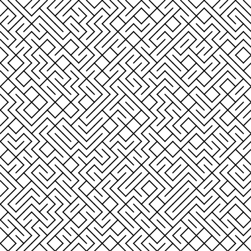
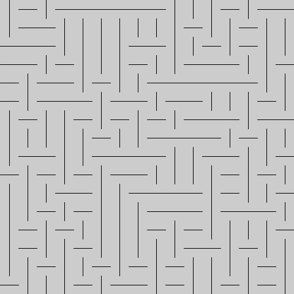
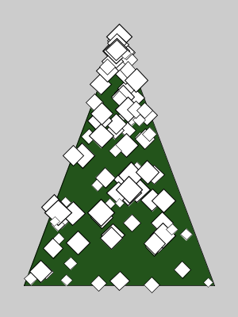

% Lecture 5: coordinate systems
% Programming for VR I
% Patrick Mineault
---
pandoc-latex-fontsize:
  - classes: [listing]
    size: scriptsize
  - classes: [footnote]
    size: tiny
---

# processing.py

* Let's play 5 things

# Previously: C64

`10 PRINT CHR$(205.5+RND(1)); : GOTO 10`



# Our challenge

* Make it happen

# Thinking strategically about the problem

* First instinct: do everything at once
* Consequence: analysis paralysis or getting nowhere fast
* Let's think about the problem in terms of subproblems

# What are logically separate pieces of the problem?

* Whiteboard time

# Translating subproblems into code

* Rule of thumb: one subproblem = one function

# In groups of 2

* Pair program the C64 maze
* Modify it to create to make a horizontal maze
* Save a screenshot
* Push it to Github, along with the screenshot

# Horizontal maze



# How did it go?

* Use `save` to save a screenshot
* You can start a git repo locally rather than clone it using `git init`

# Transformations

* We can move things, or we can move coordinate systems

{ width=45% } \ { width=45% }

# Equivalent output

* Direct method:

```{.python}
rect(x, y, w, h)
```

* Indirect method:

```{.python}
pushMatrix()
translate(x, y)
rect(0, 0, w, h)
popMatrix()
```

# Is this useful?

If we've created a function like this:

```{.python}
def house():
  triangle(15, 0, 0, 15, 30, 15)
  rect(0, 15, 30, 30)
  rect(12, 30, 10, 15)
```

We can move the house around with:

```{.python}
pushMatrix()
translate(x, y)
house()
popMatrix()
```

# Transformations

* `translate(x, y)`
* `rotate(radians)`: note 180 degrees = `PI` radians
* `size(scalex, scaley)`: also scales lines

# Let's make a tree!

* Our tree is going to be thin at the top, wide at the bottom
* It's going to have diamond shaped decorations
* Some decorations are going to be bigger than others
* A diamond is a rectangle rotated 45 degrees
* Use `translate`, `rotate` and `scale`
* Stretch: add sparkles to your tree

# My tree


