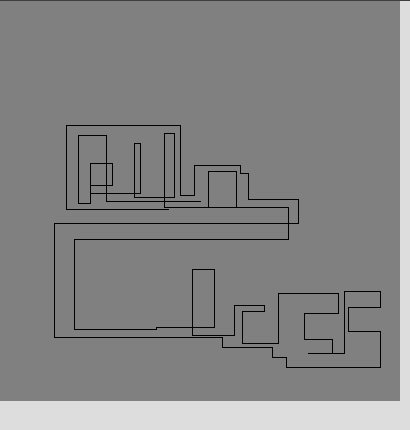

% Lecture 6: input
% Programming for VR I
% Patrick Mineault
---
pandoc-latex-fontsize:
  - classes: [listing]
    size: scriptsize
  - classes: [footnote]
    size: tiny
---

# Today's challenge

* We'll make a line painting app
* We'll draw lines with the mouse
* UP and DOWN keys will change line size
* LEFT and RIGHT will change line color

# Line painting app


# Input

* We need to respond to mouse and keyboard events
* How? Two modes: polling and events

# Polling

* You ask the computer every frame what is the state of the input
* In our case, in the `draw()` function
* In processing.py, we poll by reading predefined variables

# Polling the mouse variables

* `mouseX`, `mouseY`: mouse position
* `mousePressed`: whether any mouse button is pressed
* `mouseButton`: which mouse button is pressed, either `LEFT` or `RIGHT` (no quotes! these are CONSTANTS)
* Everything is at `https://py.processing.org/reference/`

# Draw different colored rectangles

```{.python .listing}
def setup():
    size(100, 100)

def draw():
    if mousePressed:
        if mouseButton == LEFT:
            fill(0)   # Black
        elif mouseButton == RIGHT:
            fill(255)   # White
    else:
        fill(128)   # Gray

    rect(25, 25, 50, 50)
```

# Keyboard

* `keyPressed`: whether a key has been pressed
* `key`: the key that's been pressed (e.g. 'A', '/', or `CODED`)
* `keyCode`: the key code when a special key has been pressed, for example, `UP`, `DOWN`, `LEFT`, `RIGHT`, `CTRL`, `SHIFT`.

# Etch-a-sketch



# Start with one thing: going to the right

```{.python}
def draw():
  delta = 2
  if keyPressed and key == CODED and keyCode == RIGHT:
    pushMatrix()
    translate(posX, posY)
    line(0, 0, delta, 0)
    posX += delta
    popMatrix()
```

* Will not compile!

# Remembering things from draw to draw

* We need to remember the position of the line from one call of draw to the other
* In `processing.py`, the way to do this is via globals
* You define the variable outside the function, and then call it global inside. That makes the variable stick after calling `draw`.

# Using globals
```{.python}
posX = 200
posY = 200

def draw():
  global posX, posY
  delta = 2
  if keyPressed and key == CODED and keyCode == RIGHT:
    pushMatrix()
    translate(posX, posY)
    line(0, 0, delta, 0)
    posX += delta
    popMatrix()
```

# Warning

* Globals are 99% bad, but because of the way processing works, we have to use them
* Be aware that if you use globals outside of processing people will not be happy

# Detecting space

```{.python}
if keyPressed and key == ' ':
  print("Clear the screen here")
```

# Exercice

* Complete the etch-a-sketch

# What about events?

* Another way of interacting with inputs is to use events.
* An event is triggered when an input changes, e.g. `keyReleased()`.
* `processing.py` call the function of the right name if it exists as soon as the event happens, between calls to draw.
* Multiple events can happen between draw calls.
* When would you need this? Typing game.
* In the `processing.py` docs, events are shown with parentheses.

# Putting things together

* Let's try to run `paintlines`
* Does it work?

# Trying to break the interaction

* Find corner cases
* Try to break your own work

# Basic debugging techniques

* Narrow down to a few lines
* Use plenty of print statements
* Isolate the code from its source to concentrate on the part that matters
* Comment and uncomment code

# What to do when you find a bug?

* Fix it!
* Prevent it from happening again!
* `assert` to prevent bad conditions
* Clean up the code so that code has better architecture
* Commit with git with meaningful message
