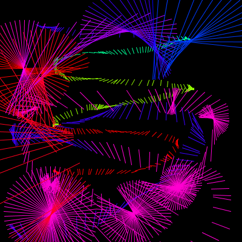

% Lecture 7: coordinate systems II
% Programming for VR I
% Patrick Mineault
---
pandoc-latex-fontsize:
  - classes: [listing]
    size: scriptsize
  - classes: [footnote]
    size: tiny
---

# We did so much!

* Python
* git
* basic data types
* arithmetic
* if/else
* for loops
* coordinates
* responding to inputs
* debugging

# Transformations

* We can move things, or we can move coordinate systems

{ width=45% } \ { width=45% }

# Equivalent output

* Direct method:

```{.python}
rect(x, y, w, h)
```

* Indirect method:

```{.python}
pushMatrix()
translate(x, y)
rect(0, 0, w, h)
popMatrix()
```

# Is this useful?

If we've created a function like this:

```{.python}
def house():
  triangle(15, 0, 0, 15, 30, 15)
  rect(0, 15, 30, 30)
  rect(12, 30, 10, 15)
```

We can move the house around with:

```{.python}
pushMatrix()
translate(x, y)
house()
popMatrix()
```

# Transformations

* `translate(x, y)`
* `rotate(radians)`: note 180 degrees = `PI` radians
* `size(scalex, scaley)`: also scales lines

# Let's make a tree!

* Our tree is going to be thin at the top, wide at the bottom
* It's going to have diamond shaped decorations
* Some decorations are going to be bigger than others
* A diamond is a rectangle rotated 45 degrees
* Use `translate`, `rotate` and `scale`
* Stretch: add sparkles to your tree

# My tree


# Stretch challenge


