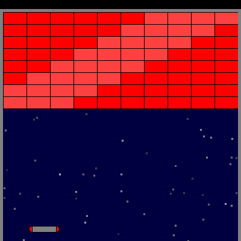
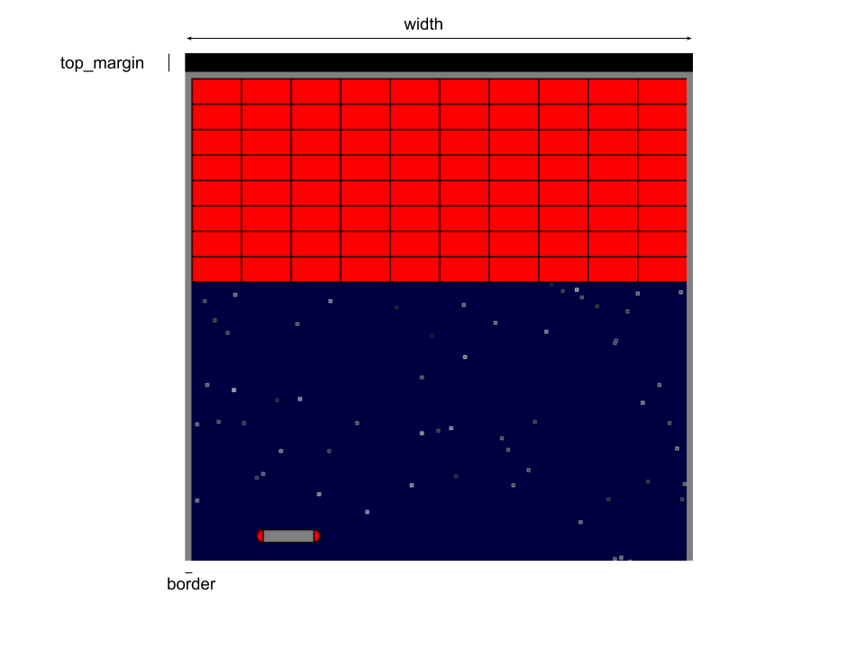

% Class 8: lab assignment I
% Programming for VR I
% Patrick Mineault
---
pandoc-latex-fontsize:
  - classes: [listing]
    size: scriptsize
  - classes: [footnote]
    size: tiny
---

# We did so much!

* Python
* git
* basic data types
* arithmetic
* if/else
* for loops
* coordinate systems
* responding to inputs

# What could we do with this?

* All the basics to control a character and draw a field

# Breakout

# Class assignment 1

* 10 points
* Teams of 4-5
* Two periods
* 10 out of 10 points: 5 MVP features (2 points each)
* 2 out of 10 points: a feature of your choosing
* Deadline is Friday after next class (January 10th)

# What is the minimum viable product (MVP)?

* Draw a paddle at the bottom of the screen with rounded sides
* Control it with both the mouse and the keyboard
* Draw bricks in a grid
* A frame around the playfield
* Code on Github

# Suggested organization

* Plan how you will implement
* Pick a feature of your choosing
* Two pair programming teams working in parallel
* One for the paddle, one for the field and bricks
* Bring them together
* (time permitting) implement one of the bonus features

# Standup

* What did you do?
* What will you work on?
* What obstacles do you foresee?

# Feature of your choosing

* Star field
* Shiny bricks
* Sprites for the bricks and/or paddles
* Bricks draw a figure

# Both the mouse and keyboard

* Tricky because you don't always want the mouse to override the keyboard
* Two modes: `mouse` or `keyboard`
* If mouse moves: change into mouse mode, read `mouseX`
* If key is pressed: change into keyboard mode, ignore `mouseX`

# The frame around the bricks

* Tricky because a lot of coordinates to think about
* Black margin on top for high scores eventually
* Gray border inside of that
* Dark blue field

# Diagram

