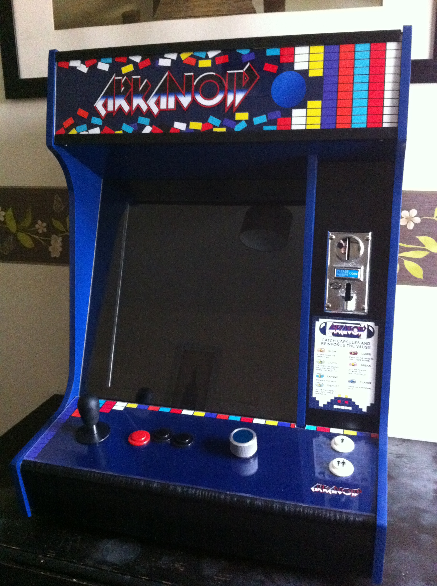

% Class 9: lab assignment I, period II
% Programming for VR I
% Patrick Mineault
---
pandoc-latex-fontsize:
  - classes: [listing]
    size: scriptsize
  - classes: [footnote]
    size: tiny
---

# MVP

* Draw a paddle at the bottom of the screen with rounded sides
* Control it with both the mouse and the keyboard
* Draw bricks in a grid
* A frame around the playfield
* Code on Github

# Tweaking the playability

# Tweaking the playability

Might consider capping the follow speed.
