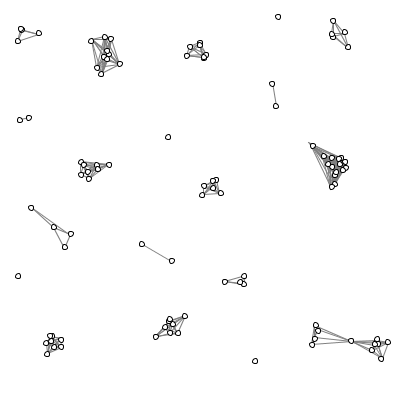

% Class 12: Lists
% Programming for VR I
% Patrick Mineault
---
pandoc-latex-fontsize:
  - classes: [listing]
    size: scriptsize
  - classes: [footnote]
    size: tiny
---

# Demo



# Introducing lists

- Right now, if we want to hold lots of pieces of information, we have to use
lots of variables.

```{.python}
brick_color_0_red = 0
brick_color_0_green = 255
brick_color_0_blue = 128
brick_color_1_red = 255
brick_color_1_green = 0
brick_color_1_blue = 64
...
```

- There might be hundreds of variables in a game (enemies, bullets, particles, stars, etc.)
- Keeping track of all these things is a pain with individual variables.
- We want a more complex data structure that can hold multiple pieces of data
  and can change size.

# Introducing lists

* A list holds multiple pieces of information, it can grow, and it can shrink.
* We can create a list like this:

```{.python}
my_list = [100, "hello", "world"]
print(my_list)
>>> [100, "hello", "world"]
```

* We can read back the elements like this:

```{.python}
print(my_list[0])
>>> 100
print(my_list[1])
>>> "hello"
print(my_list[2])
>>> "world"
print(my_list[3])
>>> IndexError: list index out of range
```

# Lists

* We can iterate through a list (go through its elements) with a for loop:

```{.python}
for i in range(len(my_list)):
  print(my_list[i])
```

* We can get the length of a list with the `len` function.

# Exercise 1: manually defined star field

```{.python .listing}
def setup():
  global star_x, star_y
  star_x = [100, 300, 200, 100, 300]
  star_y = [100, 100, 200, 300, 300]
  size(400, 400)

def draw():
  global star_x, star_y
  for i in range(len(star_x)):
    point(star_x[i], star_y[i])
```

# Adding to a list

* We can add to the end of a list using `append`:

```{.python}
my_list = []
for i in range(100):
  my_list.append(i)
```

# Exercise 2: randomized star field

```{.python .listing}
import random

def setup():
  global star_x, star_y
  star_x = []
  star_y = []
  for i in range(100):
    star_x.append(400 * random.random())
    star_y.append(400 * random.random())
  size(400, 400)

def draw():
  global star_x, star_y
  for i in range(len(star_x)):
    circle(star_x[i], star_y[i], 5)
```

# Changing values inside of an array

* We can modify an existing list by reassigning to items inside the list.

```{.python .listing}
my_list = [100, "hello", "world"]
my_list[1] = "welp"
print(my_list)
>>> [100, "welp", "world"]
```

# Exercise 3: amoeba

* Challenge!

# To remove an element

* `pop(position)`: remove the element at the position and return it

```{.python .listing}
my_list = [100, "hello", "world"]
element = my_list.pop(1)
print(element)
>>> element
```

* https://docs.python.org/3.8/tutorial/datastructures.html

# Managing lists of similar things

- In games we often have multiple instances of similar objects
   - bricks
   - enemies
   - particles (fire, fireworks, magic effects)
   - bullets
- Often, we'll place these instances in a list

# 5-minute exercise

* Shoot one bullet, left to right

# Managing bullets

* Bullets are created (added to a list)
* Bullets advance according to the physics of the world (change the list elements)
* Bullets die (removing the bullet from the list, younger bullets)
* First-in-first-out (FIFO)

# Let's shoot two bullets

```
[]  # No bullets to start with
[0]  # Add the bullet to the list
[100]  # The bullet moves to the right
[150, 0] # a second bullet is added
[250, 100] # They move in unison
[450, 300] # Bullet 1 is off the screen, time to cull
[350] # bullet 2 is left
[450] # time to cull bullet 2
[] # back to the start
```

# Example coding

* How would you code that? <whiteboard>

# Paint program

* Drawings we made so far, we couldn't undo.
* How would we make them undoable?
* Last-in-first-out (LIFO)

# Exercise


# Lists can contain other lists

```{.python .listing}
list_of_lists = [[1, 2], [3, 4, 5]]
print(list_of_lists[0])
>>> [1, 2]
print(list_of_lists[0][1])
>>> 2
```
