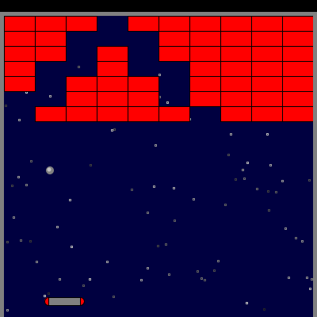

% Class 15: Assignment 2 - Lists and OOP
% Programming for VR I
% Patrick Mineault
---
pandoc-latex-fontsize:
  - classes: [listing]
    size: scriptsize
  - classes: [footnote]
    size: tiny
---

# Last 2 classes

* Lists & OOP

# This assignment

* Continue brick and paddle game
* Lists and OOP

# End result

{ width=250px}

# MVP features (2 points each)

* Brick class, which draws a brick when active
* Ball class, which moves and draws itself
* Ball is dragged along paddle until launched with click or spacebar
* Cannonball physics: when ball overlaps with a brick, the brick becomes inactive. When hitting the side walls, the ball bounces
* Posted on Github

# Brick class

```{.python .listing}
class Brick:
  def __init__(self, pos_x, pos_y, w, h):
    self.pos_x = pos_x
    self.pos_y = pos_y
    self.w = w
    self.h = h
    self.active = True

  def hit_test(self, x, y):
    # Returns true if the coordinate x, y is within the brick.
    return False

  def draw(self):
    # Draws the brick on the screen
    pass
```

# Ball class

```{.python .listing}
class Ball:
    def __init__(self, pos_x, pos_y):
        self.pos_x = pos_x
        self.pos_y = pos_y
        self.speed_x = 0
        self.speed_y = 0

    def update(self):
        # updates the position of the ball according to game physics.
        pass

    def draw(self):
        # Draws the ball on the screen
        pass
```

# Assignment

* Due by next Tuesday AM
* 4 teams
* (+2 points): Bonus feature of your choice

# Advice

* Easier to set a brick to `active = False` then to remove it from the list.
