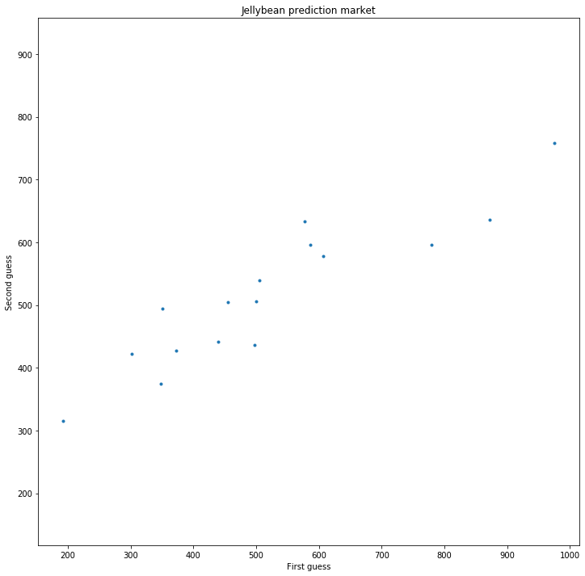
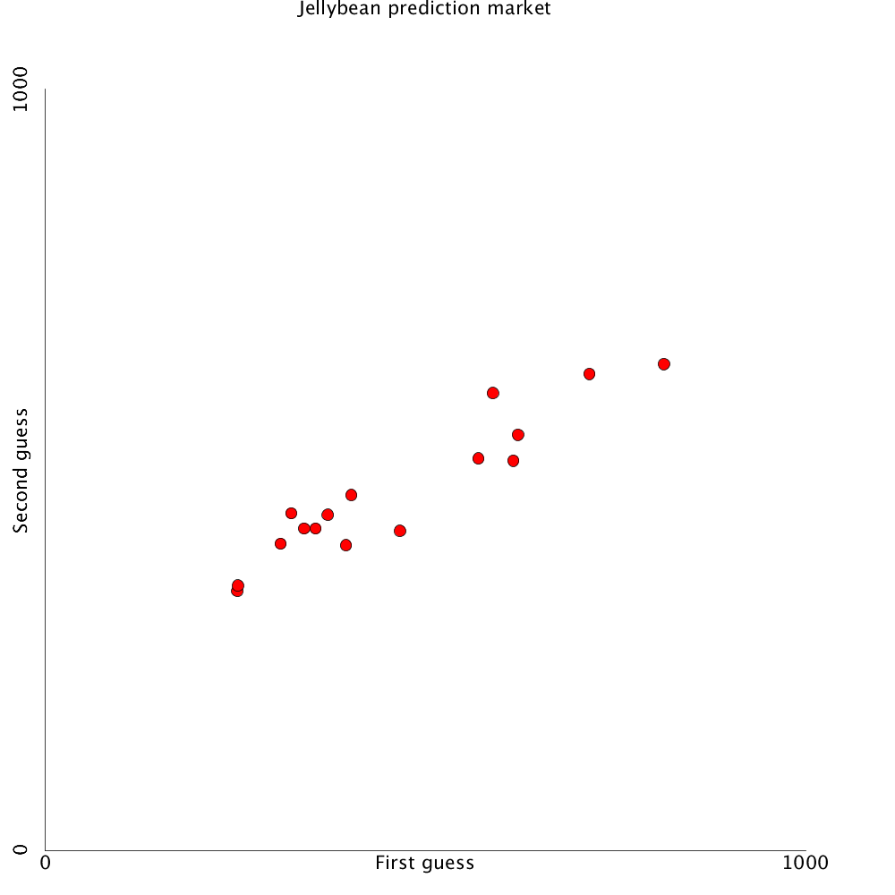

% Class 17: Stats and data science
% Programming for VR I
% Patrick Mineault
---
pandoc-latex-fontsize:
  - classes: [listing]
    size: scriptsize
  - classes: [footnote]
    size: tiny
---

# Elements of stats and data science

* Jelly bean experiment!
* How many jelly beans in this bucket?
* Whoever gets it wins (a different set of) jellybeans.
* Part 1: everybody make an individual guess.

# Bean counter

* Part 2: talk to each other. Based off of that, make a revised estimate of the number of jelly beans.

# The wisdom of crowds

* `https://en.wikipedia.org/wiki/The_Wisdom_of_Crowds`

> The opening anecdote relates Francis Galton's surprise that the crowd at a county fair accurately guessed the weight of an ox when their individual guesses were *averaged* (the average was closer to the ox's true butchered weight than the estimates of most crowd members).

# Explore this idea in Python

* Learn about files and file formats.
* Write down the data in a format the computer understands.
* Compute summary statistics: mean, median, standard deviation, variance, etc.
* Plot the data.
* Gain some insight.

# Python and files

* Python can read any file on your computer.
```{.python .listing}
file = open("hello.txt", "r")
contents = file.read()
file.close()
print(contents)
```
* The 'r' means to open the file for reading.
* On Windows, be careful about file extensions: extensions are hidden by default.

# Writing files

```{.python .listing}
file = open("bonjour.txt", "w")
file.write("Bonjour Patrick!")
file.close()
```

# The sharp bits

* Don't overwrite your own files - it won't ask you for a confirmation.

# Text files

* We're mostly going to work with text files (.txt, .csv, .json, .py, etc.).
* These files you can edit inside of a programmer's text editor (not Word, something like Notepad++, Visual Studio, atom, etc.).
* In Python we can easily read text files and manipulate them the strings they contain.

# Binary files

* There are binary files (.png, .jpg, .avi, .doc, etc.).
* These generally require special software to write and special packages to read.
* Make sure you open the files in binary mode ('rb' and 'wb' to read and write).

# File formats

* You can use a lot of different formats (csv, json, bson, xlsx, dumps of sql databases, etc.) to represent tabular data.
* CSV (comma separated value) is one of them.
* Header with columns names, one line per value, separated by comma.
* Can easily generate with Excel or write manually.

```{.python .listing}
"column1","column2"
1.000234,5.65298
3.14159,3.70788
...
```

# How do we read this?

```{.python .listing}
import csv

file = open("guesses.csv", 'r')
reader = csv.reader(file, quoting=csv.QUOTE_NONNUMERIC)
header = reader.next()
first_guesses = []
second_guesses = []
for row in reader:
    first_guesses.append(row[0])
    second_guesses.append(row[1])
file.close()

print(header)
print(first_guesses)
```

# `csv.reader`

* Can you guess what kind of thing `csv.reader` is?

# Tricky bit

```{.python .listing}
for row in reader:
  print(row)
```

* `reader` is an example of an iterator (a thing you traverse one thing at a time with a `for` loop).
* The only other example we've seen so far is `range(num)`.
* You can iterate over many things in Python: ranges, lists, lines of a file, some objects, etc.

# What we accomplished

* Take external data
* Bring it in to our program so we can manipulate ourselves
* Using a file format that's common
* Very useful pattern

# Common stats

* "In colloquial language, an average is a single number taken as representative of a list of numbers"
* Measures of centrality: mean, median

# The mean

* The sum of the data points divided by the length.

```{.python .listing}
def mean(x):
  return sum(x) / len(x)
```

# The median

* The point in the middle when you sort the data.

```{.python .listing}
def median(x):
  x_sorted = sorted(x)
  if len(x) % 2 == 1:
    # Odd length.
    return x_sorted[(len(x) + 1) / 2]
  else:
    # Even number.
    return (x_sorted[len(x)/2 - 1] + x_sorted[(len(x))/ 2]) / 2
```

# My predictions

* The mean of your initial guesses will be better than 2/3 of your initial guesses.
* The median of your initial guesses will be better than 3/4 of your initial guesses.

# Measures of dispersion

* Variance: mean of the square of the deviations from the mean
* Standard deviation: square root of that
* Standard deviation tells you how spread apart different points are.

```{.python .listing}
def sd(x):
    mx = mean(x)
    x2 = []
    for val in x:
        x2.append((val - mx) ** 2)
    return sqrt(mean(x2))
```

# My prediction

* The standard deviation of the second guesses will be lower than your first guesses.

# Plotting



# How do we make a plot in Processing?

* We know how to draw points and circles (scatter plots)
* We know how to draw lines (line plot)
* We can draw text with `text`
* We should be able to figure it out.

# A little trick of the trade

* Switch the y axis from going down to going up using scale.

```{.python}
translate(0, height)
scale(1, -1)
for i in range(len(first_guesses)):
    circle(first_guesses[i], second_guesses[i], 10)
noLoop()
```

# Cleaning things up



# Should you do this stuff in Processing?

* There's a whole ecosystem to do data science in Python that will make your life easier
* Smart data structures: numpy, pandas, xarray
* Plotting: matplotlib, plotly, seaborn
* Machine learning: sklearn, tensorflow, pytorch
* Notebooks: jupyter
* None of these are accessible to Processing

# However...

* Very easy to make animations and interactivity
* Processing good for installations, sci-art
* Processing is often the last mile
* https://www.mapzen.com/blog/animating-transitland/
