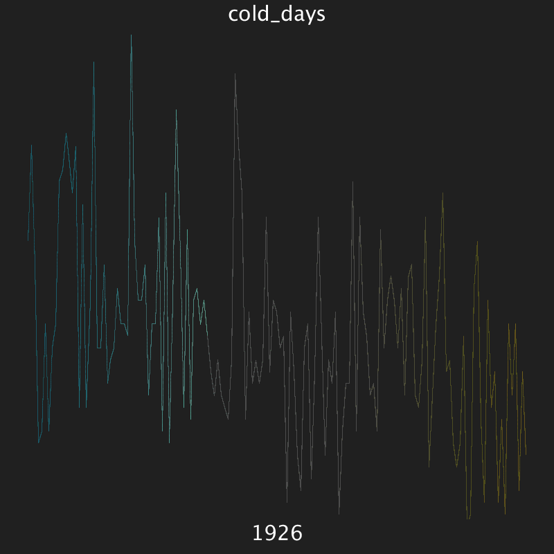

% Class 18: Stats and data science
% Programming for VR I
% Patrick Mineault
---
pandoc-latex-fontsize:
  - classes: [listing]
    size: scriptsize
  - classes: [footnote]
    size: tiny
---

# Visualizing climate change

* https://web.meteo.mcgill.ca/cmccray/climate-change-montreal-winter/

# Demo project



# Dicts

```{.python .listing}
a = {'abc': 10, 'def': 5}
a['ghij'] = "ok"
print(a['abc'])
>>> 5
print(a['ghij'])
>>> "ok"
```

# Dicts

* A dict works a lot like a list: it can grow, shrink, contain heterogenous data in slots
* However: it doesn't have an order
* Instead, it has keys which can be strings (or ints but that's less common)
* You define them with curly brackets
* You can't append to a dict, you have to assign

# What's a dict good for?

* Store a big quantity of data with meaningful names.
* `columns['snow_cm']`
* `columns['max_temp']`

# Project: modify the visualization in some way

* Visualize the number of snow days with actual snow particles
* Download and visualize future climate data
* Display an iconic photo for each decade
* Display all of the current data simultaneously, with labels and colors
