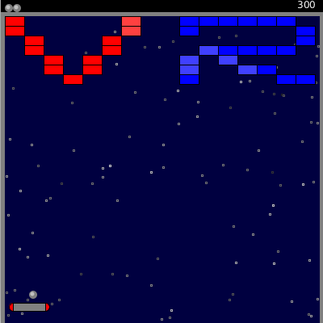
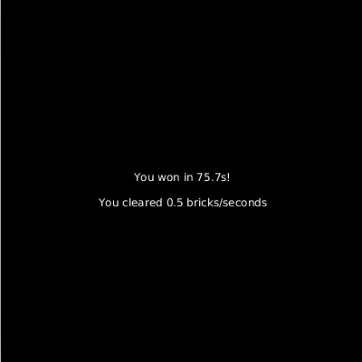

% Class 15: Assignment 3 - Files and stats
% Programming for VR I
% Patrick Mineault
---
pandoc-latex-fontsize:
  - classes: [listing]
    size: scriptsize
  - classes: [footnote]
    size: tiny
---

# Don't forget

* Exam next week
* Covers everything we've seen so far
* Variables
* Functions
* Lists
* Keyboard and mouse interactions
* Classes
* Stats
* Processing

# Practice for exam

* Code up a smoke simulation, add some mouse interaction
* https://www.youtube.com/watch?v=UcdigVaIYAk
* The tutorial is in p5.js (Processing for javascript)
* Do the assignment!

# Last 2 classes

* Files and stats

# This assignment

* Continue brick and paddle game
* Paddle bouncing
* Files and stats

# End result

{ width=250px}

# MVP features

* (2 points) Paddle collision reverses momentum of ball and moves it out of the way
* (2 points) When paddle is moving, imparts momentum on ball
* (2 points) Load brick layout from file, with blue and red bricks
* (2 points) Display the number of balls, score (100 for blue, 200 for red).
* (1 point) 3 lives, restart or win screen at the end with stats
* (1 point) Posted on Github

# End stats

{ width=250px}

# Loading a custom level

* You can read a file line by line using `readlines`
* Strings can be accessed much like lists:

```{.python .listing}
a = 'hello'
print(len(a))
>>> 5
print(a[1])
>>> 'e'
```

# Assignment

* Due by next Tuesday AM
* 4 teams
* (+2 points): Bonus feature of your choice
