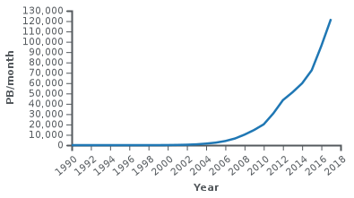
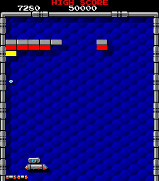

# Learn you an algorithm for great good

* An algorithm is a recipe for accomplishing a computational task
* The earliest known algorithms predate computers

---
# Muhammad ibn Musa al-Khwarizmi

* Persian mathematician (780-850) who introduced quadratic equations, algebra.
* In the 12th century, his book on numerals introduced the Western world to Hindu-Arabic numbers.
* Before then, in Europe, people used Roman numerals! Try calculating a sum in Roman numerals, it's awful:

```
    CIX
+CCCLII
=======
???????
```
* *Algorithm* is the romanization of al-Khwarizmi's name
---
# Examples of algorithms

* Long addition and multiplication
* Finding prime factors
* Sorting a list
* Finding the shortest route from point A to point B
* Simulating physics in video games
* Learning how to differentiate between objects of class A and class B

---

# Grade school algorithms

http://www.cim.mcgill.ca/~langer/250/1-gradeschool.pdf

---

# Adding two big numbers together

```code
 2543
+4519
=====
 ????
```

* No Roman numerals for us!
* Let's do it on the board!

---

# What do we do?

* Align the numbers in columns on the right
* Starting from the least-significant digit on the right:
    - Add up all the numbers plus the carray in one column
    - The total modulo 10 $\to$ the total for this digit
    - The number integer divided by 10 $\to$ the carry
    - Move one column left
---

# How do we write this in code?

* Pick a representation for the numbers and the result
* A list of single digits: 2453 $\to$ [2, 5, 4, 3]

---
# How do we write this in code?

```python
def gs_add(num1, num2):
    # Make sure the first number is the longest
    if len(num1) < len(num2):
        # Swap them out
        tmp = num2
        num2 = num1
        num1 = tmp

    nsteps = max([len(num1), len(num2)])
    carry = 0
    result = []
    for i in range(nsteps):
        # From the right
        idx = -(i + 1)

        the_num = carry
        if i < len(num1):
            the_num += num1[idx]
        if i < len(num2):
            the_num += num2[idx]

        result.insert(0, the_num % 10)
        carry = the_num / 10
    
    if carry > 0:
        # Don't forget to add the last carry
        result.insert(0, carry)

    return result
```
---

# The tricky bits

* Swapping two variables. I showed you the standard, which also works in other languages. There's an easier *magic* way of doing this in Python:

```python
num1, num2 = num2, num1
```
* Checking bounds - you don't want to run over the end of the list
* Adding the carry at the end if it's empty

---
# Aren't we just using addition to define addition?

* Yes, but only because we're lazy
* We could create an addition table to add up all numbers from 0 to 10:

```python
add_table = [[0, 1, 2, 3, 4, 5, 6, 7, 8, 9, 10],
             [1, 2, 3, 4, 5, 6, 7, 8, 9, 10, 11],
             [2, 3, 4, 5, 6, 7, 8, 9, 10, 11, 12],
             [3, 4, 5, 6, 7, 8, 9, 10, 11, 12, 13],
             [4, 5, 6, 7, 8, 9, 10, 11, 12, 13, 14],
             [5, 6, 7, 8, 9, 10, 11, 12, 13, 14, 15],
             [6, 7, 8, 9, 10, 11, 12, 13, 14, 15, 16],
             [7, 8, 9, 10, 11, 12, 13, 14, 15, 16, 17],
             [8, 9, 10, 11, 12, 13, 14, 15, 16, 17, 18],
             [9, 10, 11, 12, 13, 14, 15, 16, 17, 18, 19],
             [10, 11, 12, 13, 14, 15, 16, 17, 18, 19, 20]]

def add_single_digits(a, b):
    return add_table[a][b]
```

* Then the we can entirely remove addition from `gs_add`

---

# Checking our code

* Test the bounds of how well our code runs
* What would be some good examples to test?

---

# Stretch exercise

* Can we add up two binary numbers instead?
* Binary numbers work just like decimal numbers, except they're in base 2 instead of base 10.
* Computer generally represent numbers in binary (two states, 0 and 1, are represented by the presence or the absence of a voltage difference)

```code
 01011
+10001
======
 11100
```

---

# There are many algorithms for the same task

* E.g. multiplication
* To multiply $213 \cdot 456$, algorithm 1:

```python
def repeat_multiply(num1, num2):
    # Create something empty.
    a = 0
    for i in range(num2):
        a += num2
    return num2
```

---
# Algorithm 2: grade-school algorithm

```code
   213
*  456
======
  1278
 1165
 852
======
 97128
```
---

# Which algorithm is better?

* If both are correct, the faster one is usually preferable
* Computer scientists tend to care not about how many seconds something takes - this can vary with hardware, implementation details, etc.
* They tend to care about how many operations an algorithm takes, and how that scales with bigger inputs. 

---
# How does that work?

* Addition: 3 operations per digit. $N$ digits per number. There, it will take 3N operations to add up two numbers. We ignore constants (the 3) and say addition is $O(N)$
* Multiplication by addition. The for loop happens at most $10 ^ N - 1$ times. The addition is still $O(N)$. Therefore, it's $O(N 10^N)$.
* Multiplication by the grade school method. $O(N)$, $N$ times. It's $O(N^2)$. That's a lot better.

---
# Why do we think in this way?

* Think about Google: it's searching through billions and billions of documents. If search scaled as $O(N^2)$,  every time the internet becomes doubles in size, Google would be becoming four times slower!

<!-- _class:centered -->



---

# Let's make our own algorithm

* We need to make the ball bounce satisfyingly when we move when it hits a brick.
* But how?

---

# Let's get inspired by inverse kinematics

* Very complex movements can be simulated with IK
* Inverse kinematics in 2d: https://phaser.io/examples/v2/category/box2d
* Ragdoll phyics in Unity: https://www.youtube.com/watch?v=DInV-jHm9rk

---

# Steps in our solver

* Apply the equations of motion
* Resolve collisions by bouncing

---

# Equations of motion

```python
x = x + speed_x
y = y + speed_y
```

---

# Resolve collisions

* Collision type 1: one side of the ball touches the side of a brick. Then the ball reverses direction.
* We'll place four contact points on the ball (top, bottom, left, right)
* For the top part of the ball:

```python
if brick.hit_test(ball.pos_x, ball.pos_y - ball.radius):
    brick.active = False
    ball.speed_y = -ball.speed_y
```

---

# Exercise

Code up all four directions of collisions in a new sketch. Add a ball and place many bricks at random. I've created a template to start with (`collision.pyde`).

---

# Resolve collisions II

* Collision type 2: corner hit



---

# Resolve collisions II

* We have to measure the distance from the corner to the center of the ball
* For bottom right corner of ball:

```python
if ball.hit_test(brick.pos_x + brick.w, brick.pos_y + brick.h):
    brick.active = False
    ball.speed_x, ball.speed_y = -ball.speed_y, -ball.speed_x
```
---

# Exercise

* Implement type II collision detection for the other corners

---

# Stretch

* Iterated detection