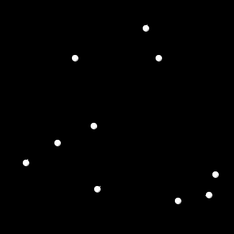
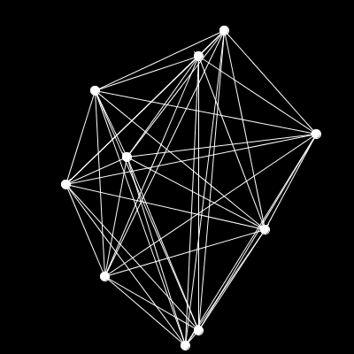

# A particle system: bonus assignment

This is an extra make-up assignment for exam 2. This assignment is due Monday ~~April 2nd~~ March 2nd, 2020 before 9AM. Your will be granted the max your exam 2 score and this extra assignment as your revised total for exam 2. Submit your answers for each question on Github and send me the link for the repo. Good luck.

Let's make a particle system in Processing.

## Question 1 (4/10 points)

Make a class called `Particle` that represents a particle with constant velocity. It should have this skeleton. Read the comments for the behaviour of this class.

```python
class Particle:
    def randomize(self):
        # should randomize position x from 0 to width
        # position y from 0 to height
        # velocity x from -5 to 5
        # velocity y from -5 to 5
        pass

    def move(self):
        # Should move the particle according to its velocity.
        # Should wrap around the screen if off limits.
        pass

    def draw_it(self):
        # Should draw a circle where the particle is.
        pass
```

## Question 2 (2/10 points)

Create a sketch that creates an instance of this particle, randomizes it once, and then every frame calls move and draw_it. When you run the sketch, it should look like this:


## Question 3 (2/10 points)

Change the sketch so that it creates 10 of these particles, all moving independently.



## Question 4 (2/10 points)

Change the sketch so that it creates 10 of these particles, all moving independently.


